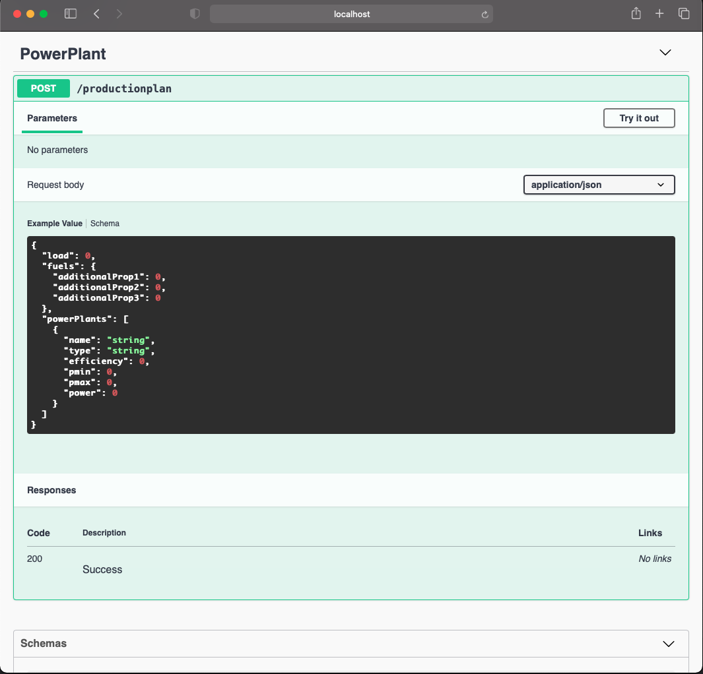

# Engie-PowerPlant

- [Engie-PowerPlant](#engie-powerplant)
  * [Run  and Install the application](#run-and-install-the-application)
    + [Single Host](#single-host)
    + [Container](#container)
  * [Open API Specification of the application](#open-api-specification-of-the-application ) 
  * [Technical Approach](#technical-approach)
     
        

My implementation of : [powerplant-coding-challenge](https://github.com/gem-spaas/powerplant-coding-challenge)

The application I have develop is based on the .NET Core 5.0  ,  a full Web APi ( Restfull ) 

A ligtweigth applicartion that we deploy in the cloud ( app services or  a aks ) 

# Run and Install the application
The easiest way is to install Visual studio community edition and the just run the app 

## Single Host
### Depedencies
 We need the follolwing package :
  - A Windows , Mac or Linux machine 
  - dotnet core sdk and runtime , version 5.0  ( Cf : [Donwload .Net core runtime](https://dotnet.microsoft.com/download) )
  - basic knowledge on command line with the dotnet CLI
    
### Command

  - First Donwload this or clone this Project , Open a terminal / Command Prompt
  - `cd Engie-PowerPlant`
  - `dotnet restore`
  -  `dotnet build` 
  -  `dotnet run ( or dotnet watch run)` 
     
## Container
### Depedencies
    On Container , We need  the docker engine present on the machine , docker is running on Linux 
    , Mac and Windows with GUI for some of the them
   [Desktop](https://www.docker.com/products/docker-desktop)
   
   [Linux](https://docs.docker.com/engine/install)
    
    
### Command
- Open a command prompt 
- `cd Engie-PowerPlant`
- `docker build -t powerplant.api . `
- `docker run -d -p 8888:8888 --name myapp powerplant.api`

  
# Open API Specification of the application

The app provide API specification for any client implementation : 

- On local `http://localhost:8888/swagger/index.html`
- Route : `/swagger/index.html`

# Technical Approach

 

